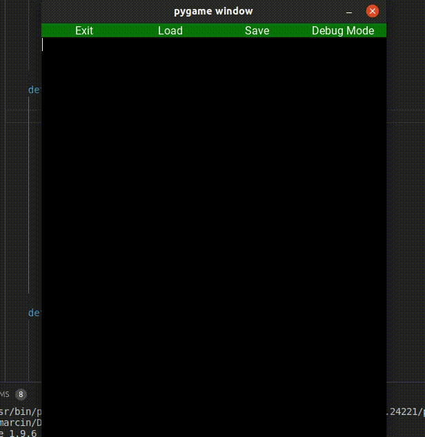

# Gap Buffer
Text editor with gap buffer implementation

## Requirements
- python3 
- pygame (`python3 -m pip install -U pygame --user`)
- tkinter (`sudo apt-get install python3-tk`)
## Usage
`python3 main.py`
